<!-- @import "[TOC]" {cmd="toc" depthFrom=1 depthTo=6 orderedList=false} -->

<!-- code_chunk_output -->

- [最初に](#最初に)
- [JMeter インストール](#jmeter-インストール)
  - [テスト実行環境構築(Linux)](#テスト実行環境構築linux)
    - [JDK インストール](#jdk-インストール)
      - [CentOS の場合](#centos-の場合)
    - [JMeter インストールM](#jmeter-インストールm)
  - [テスト計画環境構築(Windows)](#テスト計画環境構築windows)
    - [JMeter インストール](#jmeter-インストール-1)
    - [JMeter Plugins-Manager](#jmeter-plugins-manager)
    - [動作確認](#動作確認)
- [JMeter テスト計画ファイル作成](#jmeter-テスト計画ファイル作成)
    - [新規テスト計画ファイル作成](#新規テスト計画ファイル作成)
    - [負荷パラメータ設定](#負荷パラメータ設定)
    - [負荷をかけるサーバの設定](#負荷をかけるサーバの設定)
      - [URL パラメータ](#url-パラメータ)
        - [基本設定](#基本設定)
        - [関数による可変パラメータ](#関数による可変パラメータ)
          - [例：ランダム値](#例ランダム値)
          - [例：プレフィックスやサフィックスがついたランダム値](#例プレフィックスやサフィックスがついたランダム値)
    - [テスト計画ファイル保存](#テスト計画ファイル保存)
  - [実行サーバへ展開](#実行サーバへ展開)
    - [テスト計画ファイル作成環境(Windows)での作業](#テスト計画ファイル作成環境windowsでの作業)
    - [テスト実行環境(Linux)での作業](#テスト実行環境linuxでの作業)
      - [作業ディレクトリ準備](#作業ディレクトリ準備)
      - [テスト計画ファイルコピー](#テスト計画ファイルコピー)
- [JMeter テスト実行](#jmeter-テスト実行)
  - [結果観察](#結果観察)
  - [テストパラメータ変更](#テストパラメータ変更)
    - [jmx ファイルサンプル抜粋](#jmx-ファイルサンプル抜粋)
    - [パラメータ変更箇所](#パラメータ変更箇所)
      - [ループ数](#ループ数)
      - [スレッド数](#スレッド数)
      - [Ramp-Up 期間](#ramp-up-期間)

<!-- /code_chunk_output -->

# 最初に
できれば `docker` にしたい。

# JMeter インストール

## テスト実行環境構築(Linux)
負荷テストを実行するための環境をLinux上に構築します。
### JDK インストール
#### CentOS の場合
```
 sudo yum install java-1.8.0-openjdk
```

### JMeter インストールM
パッケージをダウンロードします。(バージョンは適宜変更

```
wget https://ftp.jaist.ac.jp/pub/apache/jmeter/binaries/apache-jmeter-5.4.1.tgz
```

アーカイブを展開します。
```
tar -zxvf apache-jmeter-5.4.1.tgz
```

コマンドを利用しやすいようにシンボリックリンクを作成します。
```
$ sudo ln -s /home/centos/apache-jmeter-5.4.1/bin/jmeter /usr/local/bin/jmeter
```

実行環境の準備は以上です。


## テスト計画環境構築(Windows)
テスト計画ファイルを作成するための環境をWindows に構築します。

### JMeter インストール
**ダウンロードURL**
```
https://jmeter.apache.org/download_jmeter.cgi
```
[Binaries] から apache-jmeter-x.x.x.zip のリンクをクリックしダウンロードします。
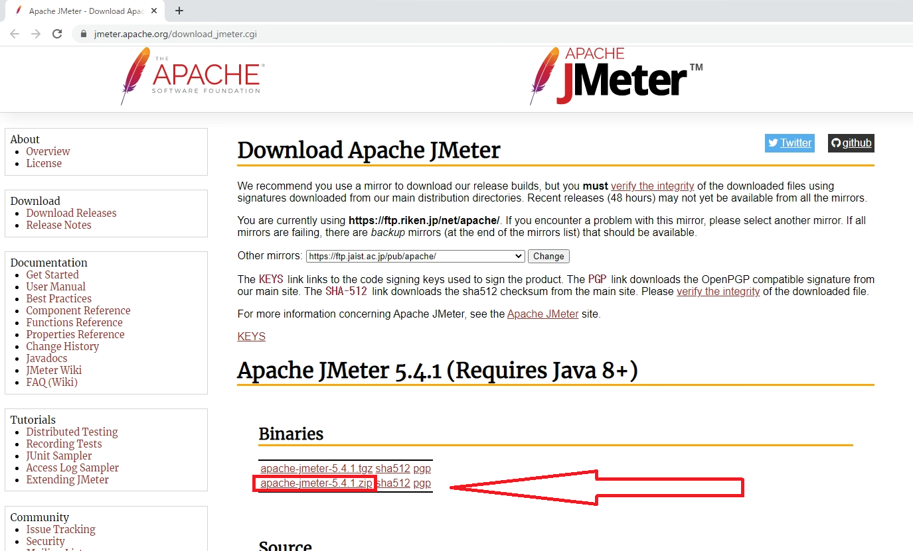

エクスプローラ などで任意のフォルダに展開します。
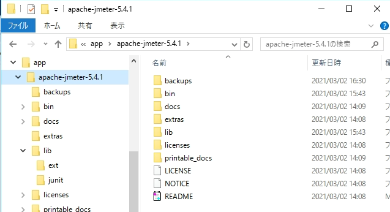

### JMeter Plugins-Manager
JMeter を拡張させるために　`Custom Plugins for Apache JMeter` をインストールします。

**ダウンロードURL**
```
https://jmeter-plugins.org/
```
画面左上の [Install] をクリックして、`plugins-manager.jar` をダウンロード
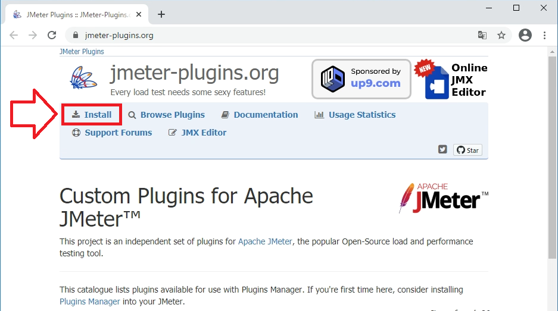

ダウンロードした `jar` は、下記画像のようにファイル名の最後にバージョンがついています。
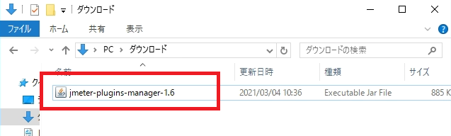

**インストール**

ダウンロードした `plugins-manager-x.x.jar` を、**JMeter**を展開した フォルダの `./lib/ext` にコピーします。

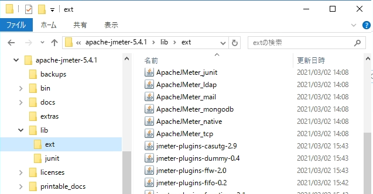
### 動作確認
**JMeter**を展開した フォルダの `./bin/jmeterw` をダブルクリックしてアプリを起動します。
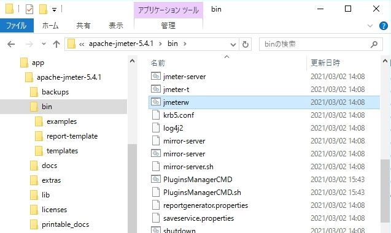

# JMeter テスト計画ファイル作成
起動した JMeter を操作します。

### 新規テスト計画ファイル作成
「ファイル」メニューの「新規」をクリックします。

### 負荷パラメータ設定
画面左側ツリーの「テスト計画」を右クリックし、コンテキストメニューから「追加」→「Thread(Users)」→「スレッドグループ」の順に選択します。
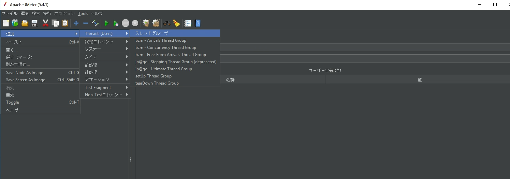

スレッドグループ設定画面で、以下の項目を設定します。
- スレッド数：同時接続数
- Ramp-Up 期間：上記「スレッド数」を作成する時間
- ループ回数：スレッド数の繰り返し回数（１をセット）
- Delay Thread creation until new needed：テスト起動初期に高負荷にならないように、処理が必要になったらスレッドを生成するようにする
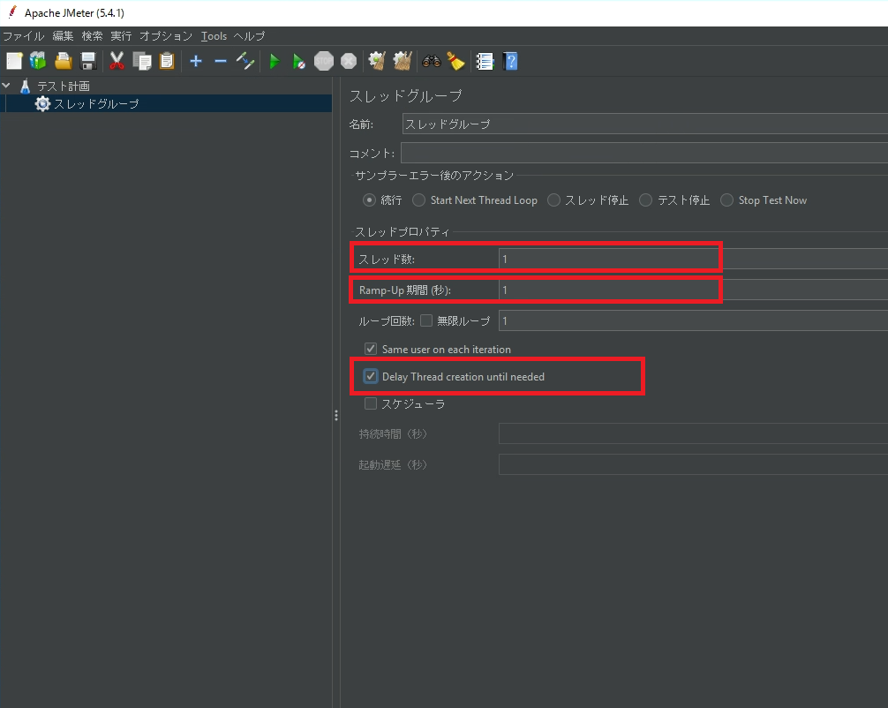

### 負荷をかけるサーバの設定
画面左側ツリーの「スレッドグループ」を右クリックし、コンテキストメニューから「追加」→「サンプラー」→「HTTP リクエスト」の順に選択します。
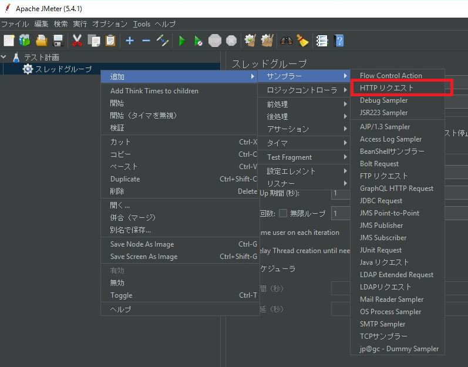

負荷をかけるサーバへの接続情報を設定します。最低限の設定は以下の通りです。

- Protocol : プロトコル指定
- Server Name or IP : 接続先サーバ名かIPアドレス
- HTTP Request : http メソッド(GET / POST などの選択)
- HTTP Request Path : URL のホスト名以降のパス

負荷をかけたいURLが `http://news.yahoo.co.jp/pickup/648xxxx` だった場合、設定は下記スクリーンショットのようになります。

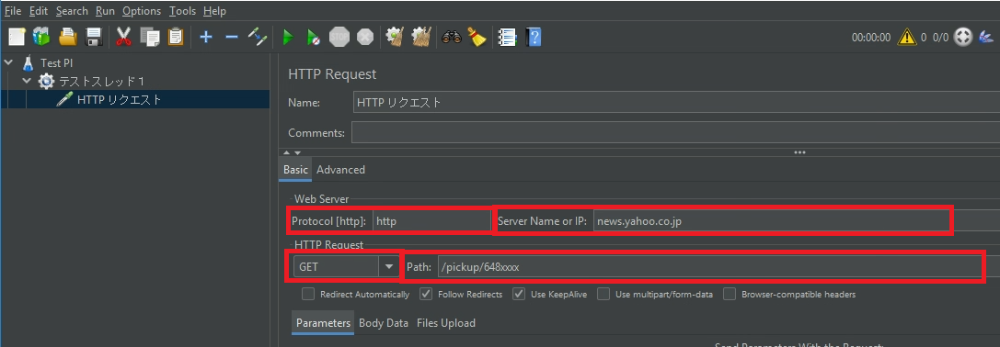

#### URL パラメータ
##### 基本設定
負荷をかける際に `URLパラメータ` を指定することもできます。
**HTTPRequest** ページの下部で `Parameters` を設定します。

設定したい URLパラメータが `?testId=500&check=true` だった場合、設定は下記スクリーンショットのようになります。パラメータを追加する場合はページ下部の「Addボタン」をクリックします。
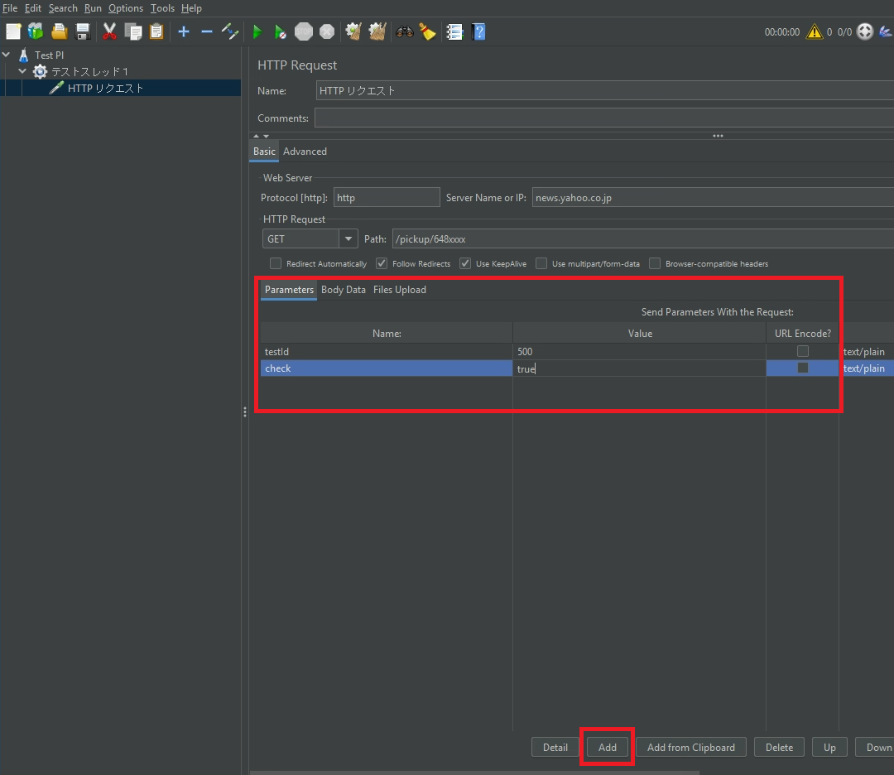

##### 関数による可変パラメータ
`Parameters` に関数を設定することでテスト時のパラメータを可変にすることができます。

関数の一覧や詳細は公式リファレンスを参照してください。

[20. Functions and Variables](https://jmeter.apache.org/usermanual/functions.html)


###### 例：ランダム値
テストしたい URLパラメータが `0 ～ 1000` までの範囲でランダムにしたい場合、関数の書式は次のようになります。

> ${__Random(0, 1000)}

実際の設定は下記スクリーンショットのようになります。
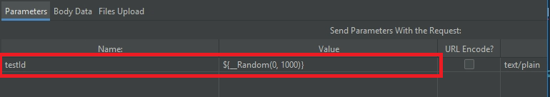

###### 例：プレフィックスやサフィックスがついたランダム値

前例に加えて **URLパラメータの数値にプレフィックス/サフィックスを設定したい** という要件にも対応できます。
例えば、URLパラメータが `Item0 ～ Item1000` までの範囲をランダムにしたい場合、設定の書式は次のようになります。

> Item${__Random(0, 1000)}

実際の設定は下記スクリーンショットのようになります。
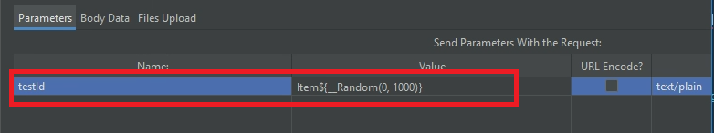

### テスト計画ファイル保存
「ファイル」メニューの「テスト計画に名前を付けて保存」をクリックし、任意の場所にテスト計画ファイルを保存します。
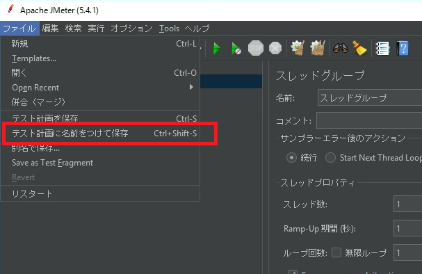

## 実行サーバへ展開

### テスト計画ファイル作成環境(Windows)での作業
[#テスト計画ファイル保存](#テスト計画ファイル保存)で保存したテスト計画ファイルを`メモ帳`などで開いておきます。
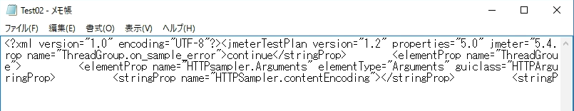

### テスト実行環境(Linux)での作業
[#JMeter インストール](#JMeterインストール)で環境構築したテスト実行サーバに `ssh` でログインします。

#### 作業ディレクトリ準備
作業ディレクトリとして、`test_work` を作成して中に移動します。

```
$ mkdir test_work
$ cd test_work
```

#### テスト計画ファイルコピー
テキストエディタを起動し、テスト計画ファイルをコピーします。（ここでは `vi` を使用します)

> vi testplan01.jmx

テスト計画ファイルの内容をコピー＆ペーストして保存します。
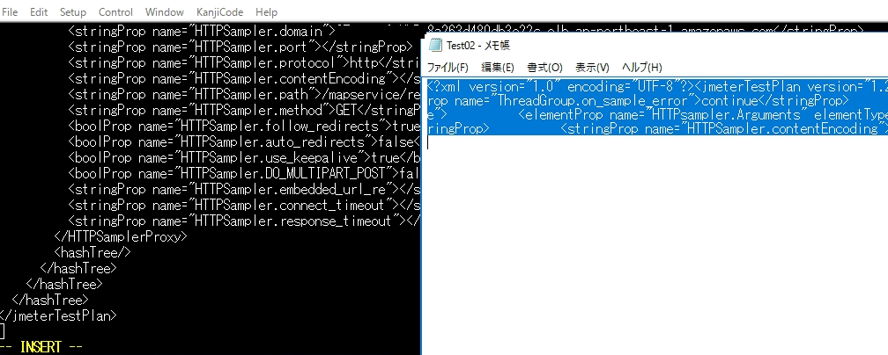

# JMeter テスト実行
以下のコマンド引数を設定して、負荷テストコマンドを実行します。コマンドの全容は公式ページの [1.4.4 CLI Mode(Command Line mode was called NON GUI mode)](https://jmeter.apache.org/usermanual/get-started.html#non_gui)[https://jmeter.apache.org/usermanual/get-started.html#non_gui] を参照してください。

- -n : CLI モードで実行します
- -t : テスト計画ファイル名を指定します
- -l : テスト結果ファイルを出力する際のファイル名を指定します
- -e : 負荷テストのレポートダッシュボードファイルを作成します。
- -o : 負荷テストのレポートダッシュボードの出力ディレクトリ名を指定します

また、Java の環境変数を指定して、`JMeter` が利用可能なメモリを変更します。

 > JVM_ARGS="-Xms12G -Xmx12G"

上記を踏まえて、実行する負荷テストコマンドラインのサンプルは以下の通りになります。

```
$ JVM_ARGS="-Xms12G -Xmx12G"  jmeter -n -t ./testplan01.jmx -l ./testplan01.jtl -e -o html_reo_testplan01
```
## 結果観察
コマンドライン引数で指定したレポート出力フォルダに、html のレポートが作成されています。(レポートの概要は[公式ページ参照](https://jmeter.apache.org/usermanual/generating-dashboard.html))


## テストパラメータ変更
負荷のパラメータであるスレッド数やループ回数の変更などは、JMeter の GUI でももちろん変更可能ですが、xml 形式のテスト計画ファイルを直接編集することも可能です。

テキストエディタで `jmx` ファイルを開きます。

### jmx ファイルサンプル抜粋
```
<?xml version="1.0" encoding="UTF-8"?>
<jmeterTestPlan version="1.2" properties="5.0" jmeter="5.4.1">
  <hashTree>
    <TestPlan guiclass="TestPlanGui" testclass="TestPlan" testname="Test Pl" enabled="true">
      <stringProp name="TestPlan.comments"></stringProp>
      <boolProp name="TestPlan.functional_mode">false</boolProp>
      <boolProp name="TestPlan.tearDown_on_shutdown">true</boolProp>
<?xml version="1.0" encoding="UTF-8"?>
<jmeterTestPlan version="1.2" properties="5.0" jmeter="5.4.1">

　　～～省略～～

    <hashTree>
      <ThreadGroup guiclass="ThreadGroupGui" testclass="ThreadGroup" testname="テストスレッド１" enabled="true">
        <stringProp name="TestPlan.comments">最初のテスト一分間に１２００アクセス</stringProp>
        <stringProp name="ThreadGroup.on_sample_error">continue</stringProp>
        <elementProp name="ThreadGroup.main_controller" elementType="LoopController" guiclass="LoopControlPanel" testclass="LoopController" testname="ループコントローラ" enabled="true">
          <boolProp name="LoopController.continue_forever">false</boolProp>
          <stringProp name="LoopController.loops">1</stringProp>
        </elementProp>
        <stringProp name="ThreadGroup.num_threads">1200</stringProp>
        <stringProp name="ThreadGroup.ramp_time">60</stringProp>
        <boolProp name="ThreadGroup.scheduler">false</boolProp>
        <stringProp name="ThreadGroup.duration"></stringProp>
        <stringProp name="ThreadGroup.delay"></stringProp>
        <boolProp name="ThreadGroup.same_user_on_next_iteration">true</boolProp>
        <boolProp name="ThreadGroup.delayedStart">true</boolProp>
      </ThreadGroup>

      ～～省略～～

  　</hashTree>
</jmeterTestPlan>
```
### パラメータ変更箇所
#### ループ数
>           <stringProp name="LoopController.loops">1</stringProp>
#### スレッド数
>        <stringProp name="ThreadGroup.num_threads">1200</stringProp>
#### Ramp-Up 期間
>        <stringProp name="ThreadGroup.ramp_time">60</stringProp>
