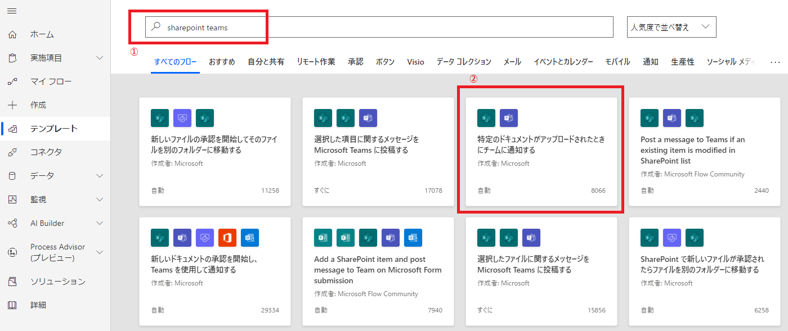

<!-- @import "[TOC]" {cmd="toc" depthFrom=1 depthTo=6 orderedList=false} -->

<!-- code_chunk_output -->

- [フロー作成](#フロー作成)
- [SharePoint 更新対象設定](#sharepoint-更新対象設定)
- [フィルタ条件設定](#フィルタ条件設定)
- [Teams 通知送信設定](#teams-通知送信設定)
  - [通知の送信先設定](#通知の送信先設定)
  - [通知メッセージ設定](#通知メッセージ設定)
- [保存とテスト](#保存とテスト)
  - [リンクがうまく表示できない場合](#リンクがうまく表示できない場合)

<!-- /code_chunk_output -->

更新されたファイルのリンクを Teams でクリックできるようにしたかったのですが、少しハマったのでまとめました。
 
# フロー作成
元となるフローは `Power Automate のテンプレート` に含まれているので、検索して選択します。

1. 検索欄に `sharepoint teams` と入力して検索
2. 「特定のドキュメントがアップロードされたときにチームに通知する」を選択

確認画面では「続行」ボタンをクリックします。

フローが展開されます

# SharePoint 更新対象設定
更新通知したいSharePoint のフォルダを設定していきます。

0. 「アイテムまたはファイルが修正されたとき」の項目をクリックして開きます。
1. **サイトのアドレス** では、更新通知したいファイルが格納されている SharePoint のサイトを選択します。テキストボックスを選択すると、フロー作成ユーザがアクセス可能なサイト一覧が表示されます。
2. **リストやライブラリの名前** では `ドキュメント` を選択します。
3. **フォルダ** では、サイト内で監視したいフォルダを選択します。

# フィルタ条件設定
「条件」の項目をクリックして開きます。

更新通知したいファイルを **ファイル名** や **ファイルの更新者** などを条件にして、フィルタリングすることができます。

(キャプチャは「更新者の表示名」でフィルタする条件です)

# Teams 通知送信設定
## 通知の送信先設定
フィルタリングされた更新内容を Teams のチャネルへ通知させる設定をしていきます。

1. **投稿者** では `Flow bot` を選択します。
2. **投稿先** では `Channel` を選択します。
3. **Team** では 通知したいチームを選択します。テキストボックスを選択すると、アクセス可能なチーム一覧が表示されます。
4. **Channel**では チーム内のチャネルを選択します。テキストボックスを選択すると、チャネル一覧が表示されます。

## 通知メッセージ設定

**Message** テキストボックスに、Teams に通知したいメッセージを記述します。
`動的なコンテンツ` という変数のようなものをメッセージに含めることができます。
`HTMLタグ` や `Markdown` の書式でメッセージを装飾することもできます。

# 保存とテスト
フローの設定が完了したら、フローのテストをします。画面右上の「テスト」をクリックします。

今回は **手動** のテストを選択し「テスト」ボタンをクリックします。
「テスト」ボタンをクリックしたら [SharePoint 更新対象設定](#SharePoint-更新対象設定)で設定した SharePoint のフォルダにファイルを **アップロード** するか、**既存のファイルを更新** します。

すると、Teams のチャネルにメッセージが投稿されます。

## リンクがうまく表示できない場合
Teams に通知されたメッセージのリンク部分がうまく表示されないことがあります。下のスクリーンショットは、リンクのURLが そのまま表示されてしまっています。

その場合は、「チャットまたはチャネルでメッセージを投稿する」画面で **コードビュー** モードにする必要があります。

これで、`HTMLタグ` や `Markdown` がそのまま Teams に送信されて、キレイなレイアウトで投稿できるようになります。