# 目標
node-red-contrib-model-asset-exchange で物体認識した結果を取得します

## 知識材料 
- [Node-RED](https://nodered.jp/)
- [enebular](https://docs.enebular.com/ja/)

## 利用環境
- enebular

## 今回のゴール
node-red-contrib-model-asset-exchange ノードを利用して、「画像の概要」と「物体検出」を体験します。
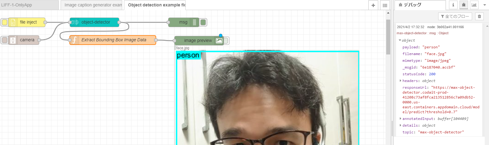

# 環境準備
あらかじめ [enebular](https://www.enebular.com/ja/) へサインアップして、フローエディターを起動しておいてください。

画面右上の「三(ハンバーガー)」メニューをクリックし、**パレットの管理** メニューを選択します。
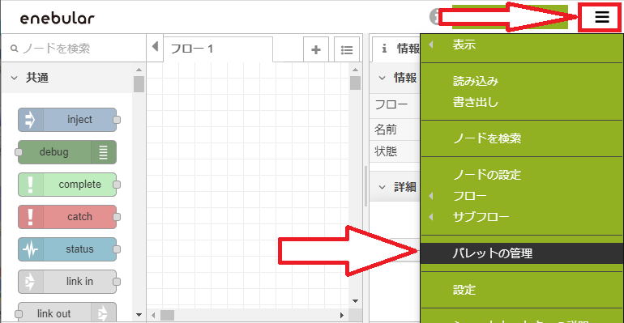

「ユーザ設定画面」にて以下の操作をします。
## node-red-contrib-model-asset-exchange 追加
「画像の概要」や「物体検出」を処理するノードを追加します。

1. 左側メニューから **パレット** を選択します
2. 上部 **ノードを追加** タブを選択します
3. *ノードを検索* と表示されているテキストエリアに `model-asset` と入力します
4. 表示された **node-red-contrib-model-asset-exchange** の **ノードを追加** ボタンをクリックします

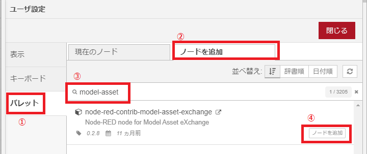

画面上部に警告ダイアログが表示されるので **追加** ボタンをクリックします。
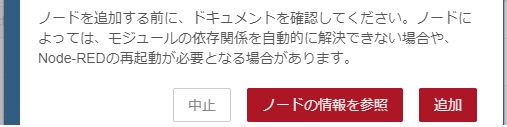

## node-red-contrib-browser-utils 追加
ブラウザで 「ファイルのアップロード」や「webカメラ」を利用できるノードを追加します。
[前項](#node-red-contrib-model-asset-exchange-追加)に続いて「ユーザ設定画面」で操作します

1. *ノードを検索* と表示されているテキストエリアに `browser-util` と入力します
2. 表示された **node-red-contrib-browser-utils** の **ノードを追加** ボタンをクリックします
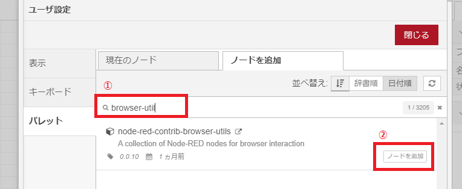

## node-red-contrib-image-output 追加
フローエディタ上でイメージデータの確認することができるノードを追加します。
[前項](#node-red-contrib-model-asset-exchange-追加)に続いて「ユーザ設定画面」で操作します

1. *ノードを検索* と表示されているテキストエリアに `image-output` と入力します
2. 表示された **node-red-contrib-image-output** の **ノードを追加** ボタンをクリックします
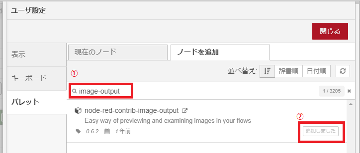

# image-caption-generator (画像概要取得) を試す
## サンプル読み込みとデプロイ
画面右上の「三(ハンバーガー)」メニューをクリックし、**読み込み** メニューを選択します。
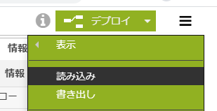

「フローをクリップボードから読み込み画面」にて以下の操作をします。

1. 左側メニュから **サンプル** を選択します
2. 画面真ん中の「サンプル」ツリーを展開し、**image-caption-generator** を選択します
3. 画面下部の「読み込み」ボタンをクリックします。

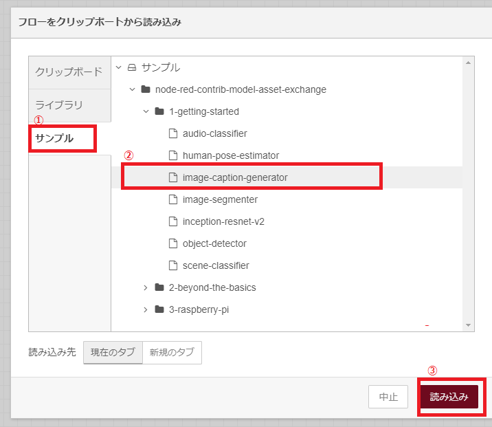

そうすると、下記のフローが展開されます。
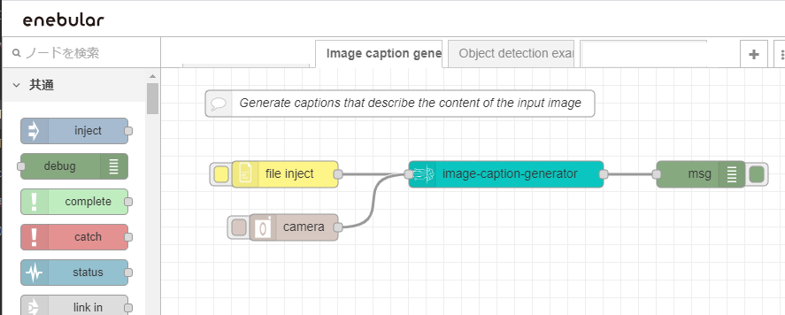

画面右上の **デプロイ** ボタンをクリックし、フローをデプロイします。

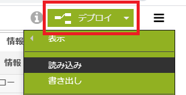

## サンプルの実行
あらかじめ、enebular 右側の「デバッグウインドウ」を有効にしておきます。
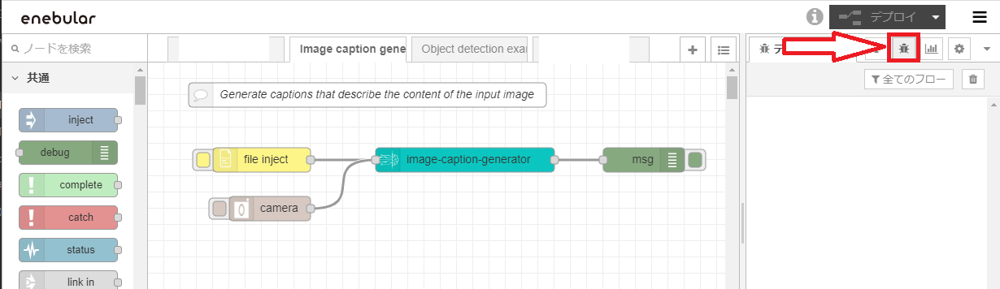

展開されたフローの **file inject** ノードの左ボタンをクリックし、画像概要取得したいイメージファイルを選択します。
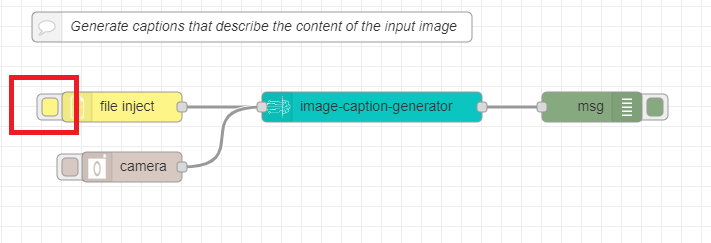

正しく処理されると「デバッグウインドウ」に「画像の概要メッセージ」が英語で表示されます。（下記例では、`a man in a suit and tie holding a toothbrush .` と判定されています）
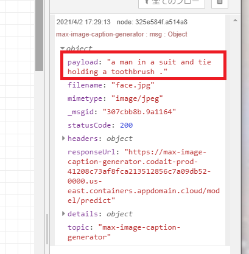

# object-detector (物体認識) を試す
## サンプル読み込みとデプロイ
画面右上の「三(ハンバーガー)」メニューをクリックし、**読み込み** メニューを選択します。

「フローをクリップボードから読み込み画面」にて以下の操作をします。

1. 左側メニュから **サンプル** を選択します
2. 画面真ん中の「サンプル」ツリーを展開し、**object-detector** を選択します
3. 画面下部の「読み込み」ボタンをクリックします。

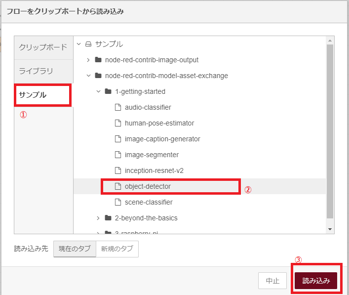

そうすると、下記のフローが展開されますので、**デプロイ** しておいてください。
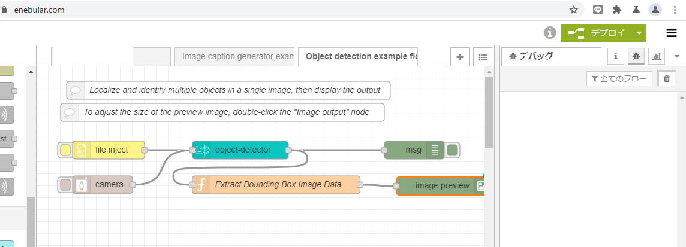

## サンプルの実行
展開されたフローの **file inject** ノードの左ボタンをクリックし、物体認識取得したいイメージファイルを選択します。
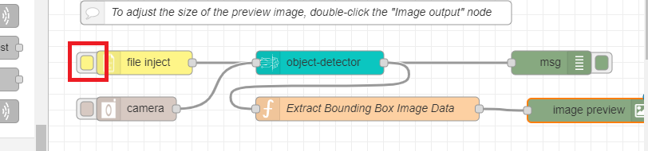

正しく処理されると、フロー下部の **image preview** ノードの下に、検出されたオブジェクトが視覚的に分かるように表示されます。まデバッグウインドウに、検出されたオブジェクトが出力されます。

## まとめ
Node-Red を使って画像認識を簡単に試すことができるということがわかりました。今回は既存のファイルを選択して試しましたが、カメラで撮影した画像をそのまま処理することもできるので、PCやスマホのWebカメラや、TJBot のカメラ入力から物体検出して…という何かが作成できる手ごたえを得ました。