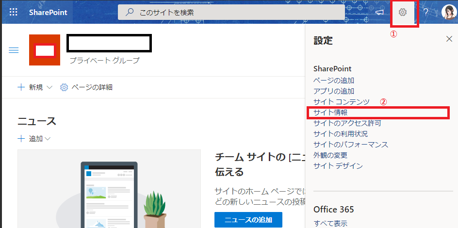
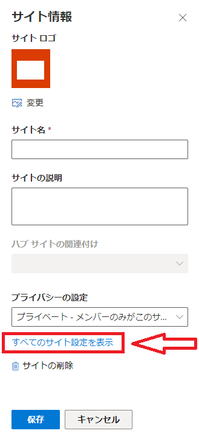
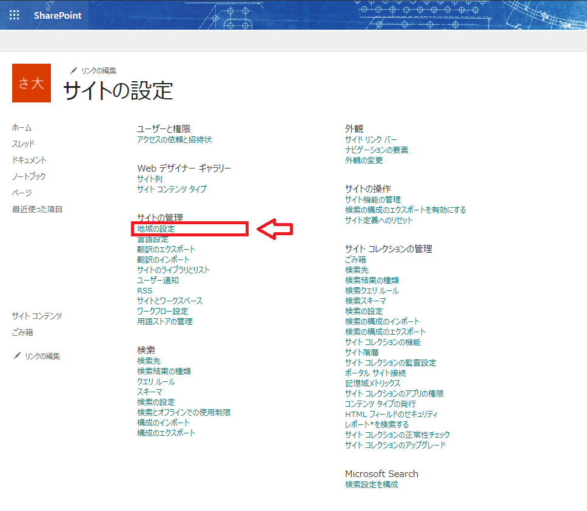
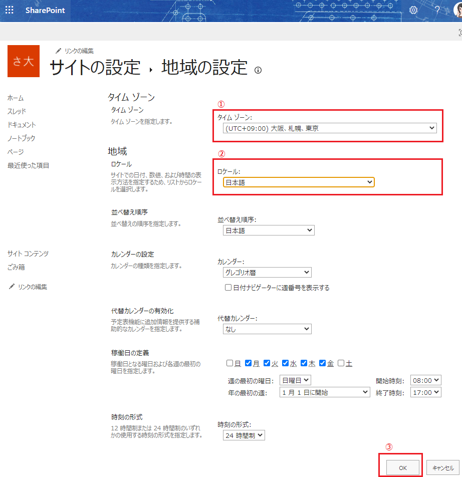
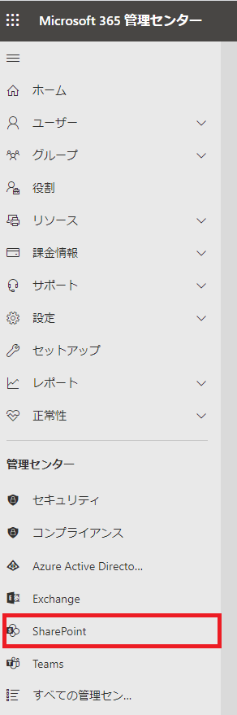
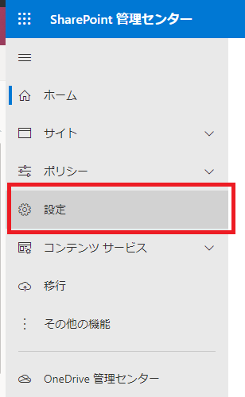
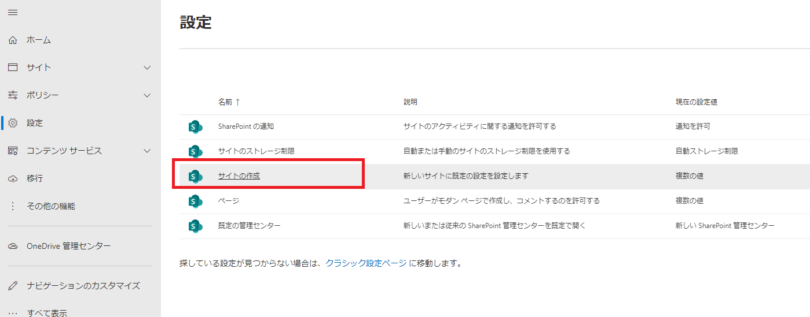
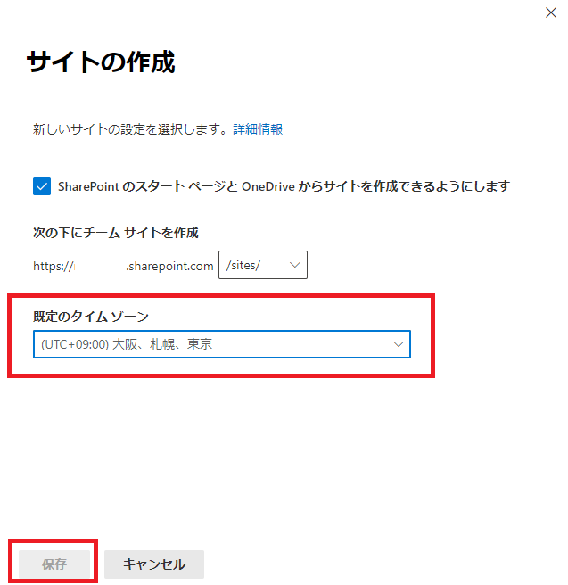

# 作成済みサイトのタイムゾーン設定
サイトの設定をするには、**サイトの管理者権限** が必要です。
## サイト情報メニュ表示
1. SharePoint の該当のサイトにアクセスし、画面上部の「設定」ボタンをクリックします。
2. 表示されたメニューの **サイト情報** をクリックします。

## すべてのサイト設定を表示

表示された 「サイト情報」メニューの下部 **すべてのサイト設定を表示**　をクリックします。

## サイト設定

表示された「サイトの設定」画面から **サイトの管理** 項目にある **地域の設定** をクリックします。

## タイムゾーン設定

1. **タイムゾーン** が [米国およびカナダ] になっているので、`(UTC+09:00) 大阪、札幌、東京` にします。
2. **ロケール** が [英語(米国)]になっているので、`日本語`にします。
3. 画面下部の「OK」ボタンをクリックして変更を確定します。

# 新しく作成するサイトの既定のタイムゾーン設定

既定のタイムゾーンを設定するには **Microsoft 365 の管理者アカウント**である必要があります。

## SharePoint 管理センターを表示

管理者アカウントでログインしたら、**Microsoft 365 管理センター** メニューから **SharePoint** を選択します。

## SharePoint 設定を表示

「SharePoint 管理センター」のメニューから **設定** を選択します。

## タイムゾーン設定

1. 「設定」画面で **サイトの作成** を選択します。
2. 「サイトの作成」画面で **既定のタイムゾーン** を `(UTC+09:00)大阪、札幌、東京` にします。
3. 設定が完了したら画面下部の「保存」ボタンをクリックします。

###「設定画面」

###「サイトの作成画面」

